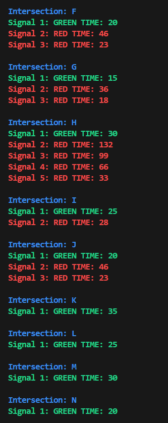

# cpp-trafficSim

**A Real Time Traffic Simulator in C++**

**Group Members**
###
1) Mohammad Abdullah 23i-0121  **Leader**
2) Muhammad Hasaan 23i-0094
3) Muhammad Talha Akram 23i-0139
###

**INTRODUCTION**

###
The Traffic Simulator is a project designed to replicate real-world urban traffic management. In this, we make use of data structures like graphs, heaps, and priority queues etc, and algorithms such as Dijkstra's Algorithm and the A* Algorithm for routing. This system provides efficient vehicle routing, congestion monitoring, traffic signal control, and emergency vehicle handling. It is built to dynamically adapt to traffic conditions and simulate various scenarios like peak-hour congestion, emergencies, and road closures.
###

**FEATURES**

###

**City Traffic Network**:

1) Represents the city as a weighted, directed graph.
2) Dynamic addition and removal of roads or intersections.
3) Provides visualization of the road network.

**Traffic Signal Management**:

1) Adjusts green/red signal durations dynamically based on traffic density.
2) Uses priority queues for efficient signal control.
3) Supports an emergency override for prioritizing emergency vehicles (*increased priority*).

**Vehicle Routing System**:

1) Computes the shortest or fastest routes using Dijkstra's algorithm.
2) Dynamically recalculates routes when traffic conditions change.
3) Tracks vehicle movements across the network.
4) Simulate either until all roads are empty or for a specified amount of time (*in seconds*).

**Congestion Monitoring**:

1) Tracks vehicle density on each road using hash tables.
2) Detects congestion zones using BFS/DFS and reroutes traffic dynamically.
3) Displays congestion levels.

**Emergency Vehicle Handling**:

1) Provides optimal routes for emergency vehicles using A*.
2) Overrides normal traffic flow for faster emergency responses.
3) Restores normal operations post-clearance.

**Road Closure Simulation**:

1) Dynamically blocks roads or intersections as long as they exist.
2) Recalculates affected routes in real-time.

**Simulation Dashboard**:

1) Interactive console-based interface for controlling and visualizing the simulation.
2) Displays the city traffic network, signal statuses, congestion levels, and blocked roads.
3) Allows manual addition of vehicles and road modifications.

###

**HOW TO RUN**

###
Simply run the command:      *g++ -o app main.cpp & ./app*            
###

**SAMPLE OUTPUT**

###
1) **Simulation Dashboard**

2) **City Traffic Network**

3) **Traffic Signal Status**

4) **Display Blocked Roads**

5) **Manually Block Roads**

6) **Manually Add Vehicles**

7) **Vehicle Routing Simulation**

###
